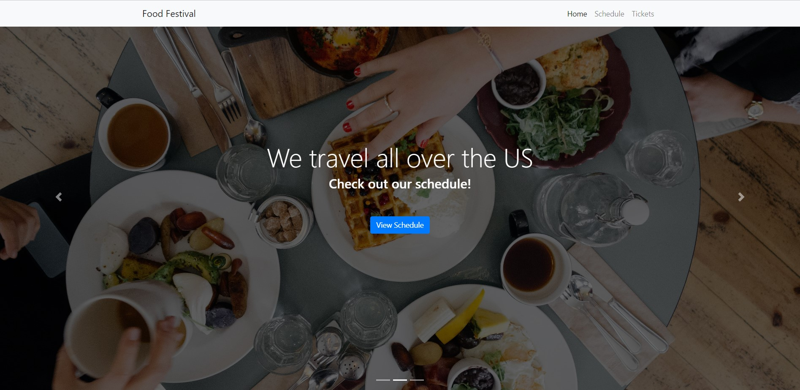

# Food Festival

(Progressive Web Applications (PWA) project)

- Convert a web application to a PWA, optimize the app's assets for performance, set up webpack in a front-end project, and use service workers to cache assets for offline functionality.

## Application

[GitHub Pages](https://epw80.github.io/Food-Festival/)

## Built with

- Bootstrap
- JavaScript
- html
- CSS

## Demo

## Screenshot

<!--  -->

## Contributor

Erik Williams
